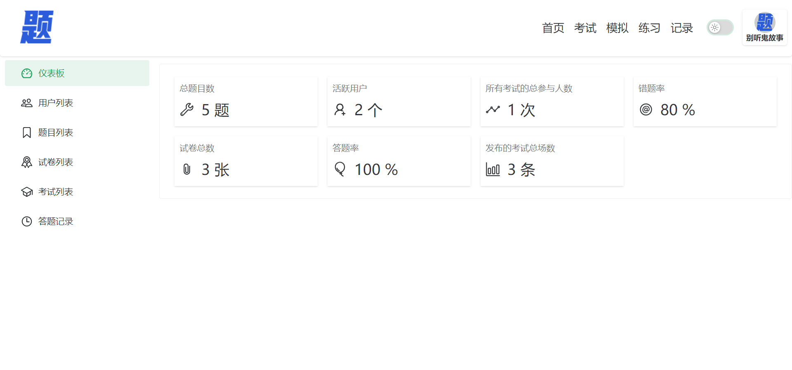
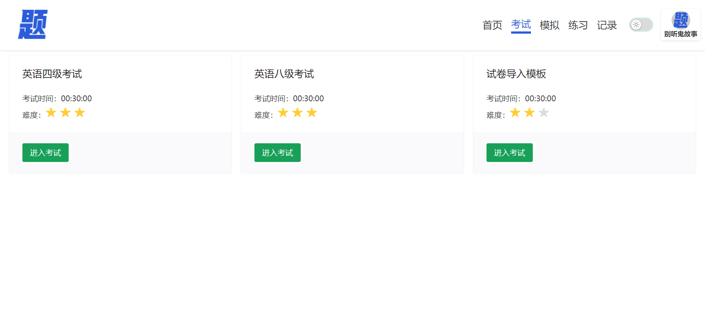
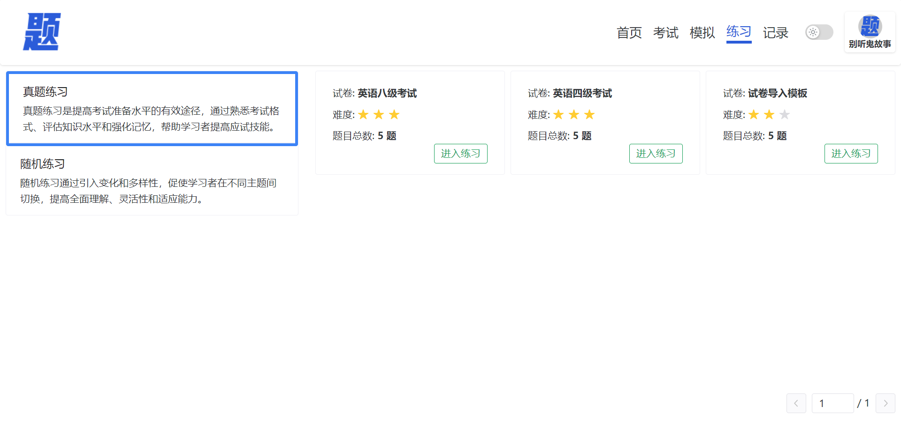
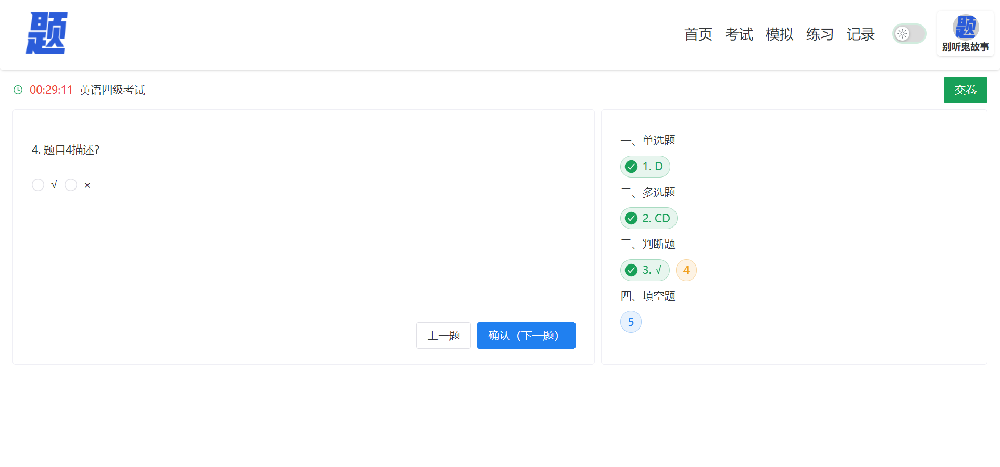

# 题库

项目使用vue3+vite+naive-ui+typescript等最新的技术栈开发的轻量级在线考试系统

[预览项目](https://qbank.yuxiaoyu.top/)

账号: `admin@qq.com`  
密码: `Az.123123!`

## 项目用到的开源库

### 图标库

[xicons](https://www.xicons.org/)

### ChartJS

[文档](https://www.chartjs.org/docs/latest/samples/bar/border-radius.html)

[vue-chartjs](https://vue-chartjs.org/)

### naive-ui

[文档](https://www.naiveui.com/zh-CN/dark/)
